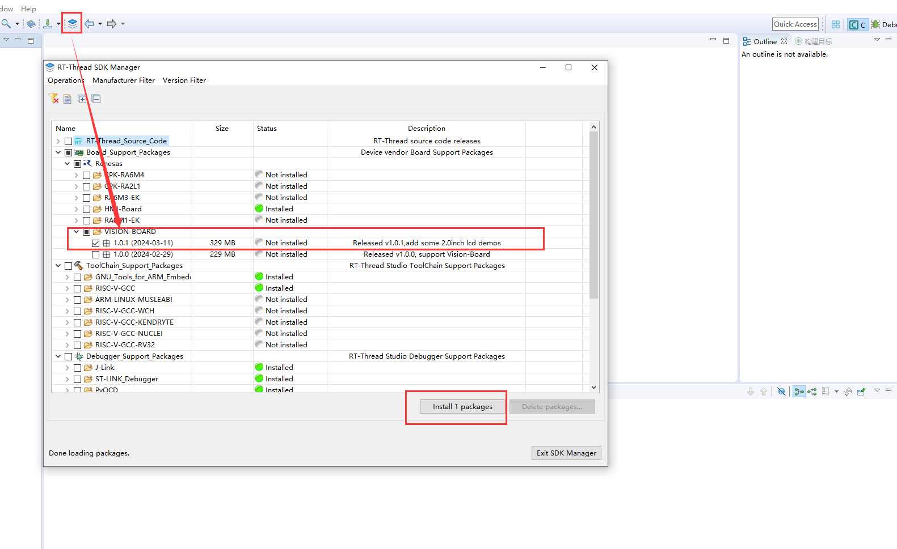
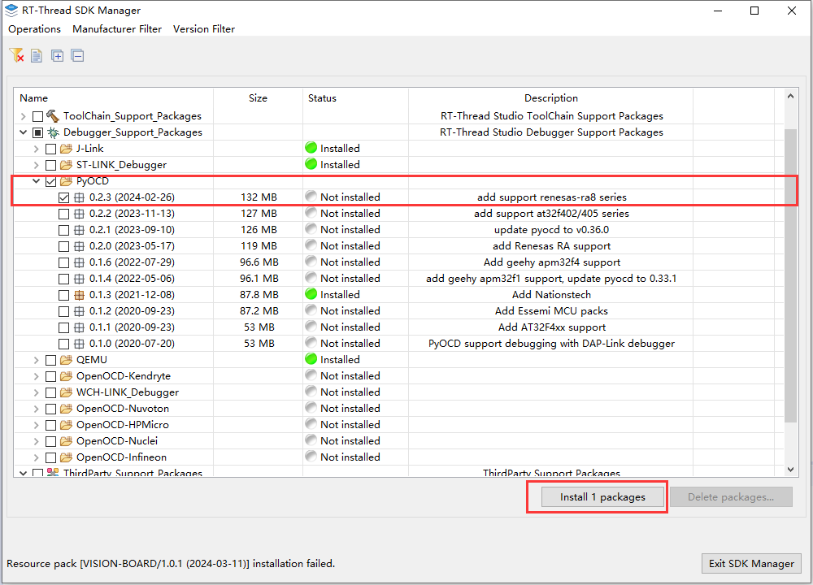
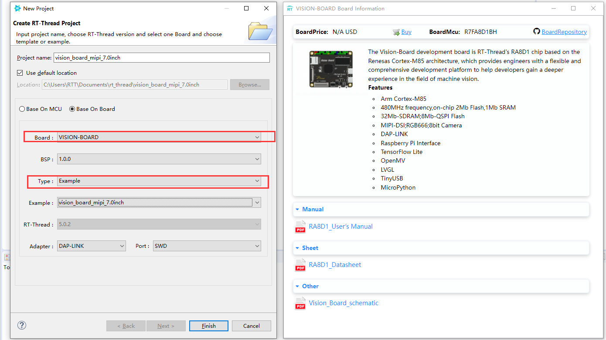
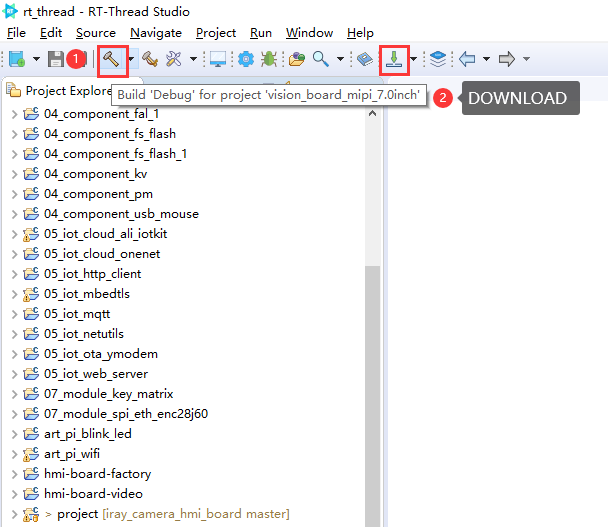
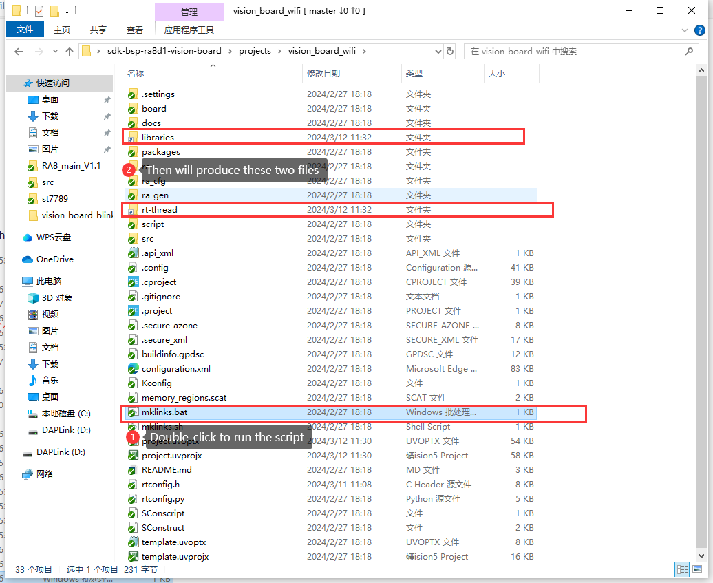
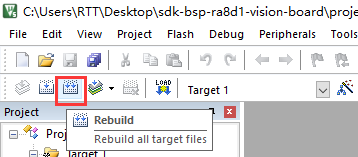
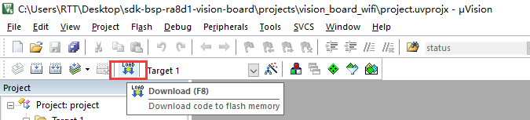

# sdk-bsp-ra8d1-vision-board

**English** | [**中文**](./README_zh.md)

## Introduction

**sdk-bsp-ra8d1-vision-board** is the support package developed by the RT-Thread team for the Vision-Board development board. It serves as a software SDK for users to simplify their application development process.

The Vision-Board development board, based on the Renesas Cortex-M85 architecture RA8D1 chip, offers engineers a flexible and comprehensive development platform, empowering them to explore the realm of machine vision more deeply.

[](https://github.com/RT-Thread-Studio/sdk-bsp-ra8d1-vision-board/blob/master/documents/images/big.png)

## Directory Structure


```
$ sdk-bsp-ra8d1-vision-board
├── README.md
├── sdk-bsp-ra8d1-vision-board.yaml
├── documents
│   ├── coding_style_cn.md
│   ├── RA8D1_Datasheet.pdf
│   ├── RA8D1_User’s Manual.pdf
│   ├── Vision_Board_schematic.pdf
│   └── images
├── libraries
│   ├── HAL_Drivers
├── projects
│   ├── lcd
│   │   ├── vision_board_mipi_2.0inch
│   │   ├── vision_board_mipi_7.0inch
│   │   └── vision_board_rgb_4.3inch
│   ├── doom
│   │   ├── vision_board_mipi_2.0inch_doom
│   │   └── vision_board_rgb_4.3inch_doom
│   ├── nes
│   │   ├── vision_board_mipi_2.0inch_nes
│   │   └── vision_board_rgb_4.3inch_nes
│   ├── lvgl
│   │   ├── vision_board_mipi_2.0inch_lvgl
│   │   └── vision_board_rgb_4.3inch_lvgl
│   ├── vision_board_blink_led
│   ├── vision_board_camera
│   ├── vision_board_openmv
│   └── vision_board_wifi
└── rt-thread
```


- sdk-bsp-ra8d1-vision-board.yaml: Contains hardware information for Vision-Board.
- documents: Includes drawings, documents, images, datasheets, etc.
- libraries: Generic peripheral drivers for RA8D1.
- projects: Consists of example project folders, including factory programs, OpenMV programs, etc.
- rt-thread: Holds the RT-Thread source code.

## Usage

**sdk-bsp-ra8d1-vision-board** supports development using both RT-Thread Studio and MDK.

## RT-Thread Studio Development Steps

1. Open RT-Thread Studio and install the Vision Board development board support package (it's recommended to install the latest version).



2. Download and install PyOCD version ≥0.2.3 (required for firmware flashing).



3. Create a new Vision Board project by selecting File -> New -> RT-Thread Project -> Based on Development Board. You can create example or template projects.



4. Compile and download the project.



## MDK Development Steps

1. Execute the mklinks.bat file to generate two folders: rt-thread and libraries.



*Note: If the mklinks script cannot be executed, manually copy the rt-thread and libraries folders from the sdk-bsp-ra8d1-vision-board directory to the project directory.*

2. Open the project.uvprojx file to launch the MDK project.

[](https://github.com/RT-Thread-Studio/sdk-bsp-ra8d1-vision-board/blob/master/documents/figures/uvprojx.png)

3. Click the build button to compile the project.



4. Click the download button to flash the firmware.

