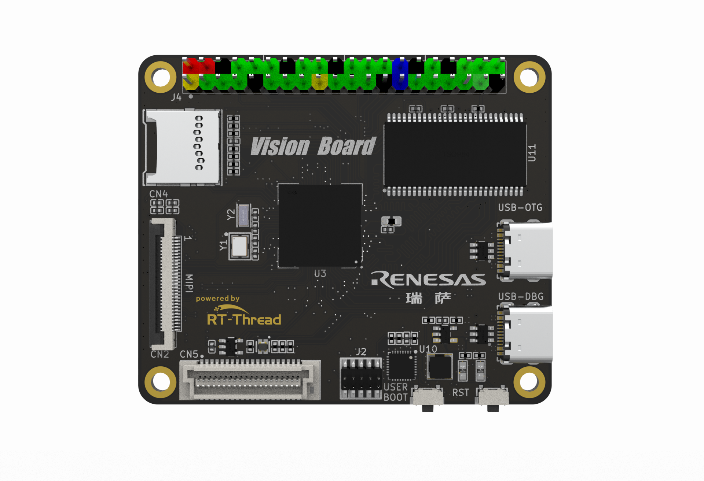

# sdk-bsp-ra8d1-vision-board

**中文** | [**English**](./README.md)

## 简介

中文页

sdk-bsp-ra8d1-vision-board 是 RT-Thread 团队对 Vision-Board 开发板所作的支持包，也可作为用户开发使用的软件SDK，让用户可以更简单方便的开发自己的应用程序。

Vision-Board 开发板是 RT-Thread 推出基于瑞萨 Cortex-M85 架构 RA8D1 芯片，为工程师们提供了一个灵活、全面的开发平台，助力开发者在机器视觉领域获得更深层次的体验。



## 目录结构

```
$ sdk-bsp-ra8d1-vision-board
├── README.md
├── sdk-bsp-ra8d1-vision-board.yaml
├── documents
│   ├── coding_style_cn.md
│   ├── RA8D1_Datasheet.pdf
│   ├── RA8D1_User’s Manual.pdf
│   ├── Vision_Board_schematic.pdf
│   └── images
├── libraries
│   ├── HAL_Drivers
├── projects
│   ├── lcd
│   │   ├── vision_board_mipi_2.0inch
│   │   ├── vision_board_mipi_7.0inch
│   │   └── vision_board_rgb_4.3inch
│   ├── doom
│   │   ├── vision_board_mipi_2.0inch_doom
│   │   └── vision_board_rgb_4.3inch_doom
│   ├── usb
│   │   ├── vision_board_tinyusb
│   │   └── vision_board_tinyusb_uvc
│   ├── nes
│   │   ├── vision_board_mipi_2.0inch_nes
│   │   └── vision_board_rgb_4.3inch_nes
│   ├── lvgl
│   │   ├── vision_board_mipi_2.0inch_lvgl
│   │   └── vision_board_rgb_4.3inch_lvgl
│   ├── vision_board_blink_led
│   ├── vision_board_camera
│   ├── vision_board_openmv
│   └── vision_board_wifi
└── rt-thread
```

- sdk-bsp-ra8d1-vision-board.yaml：描述 Vision-Board 的硬件信息
- documents：图纸，文档，图片以及 datasheets 等
- libraries ：RA8D1 通用外设驱动
- projects：示例工程文件夹，包含出厂程序，OpenMV 程序等
- rt-thread： rt-thread 源码

## 使用方式

`sdk-bsp-ra8d1-vision-board` 支持 **RT-Thread Studio** 和 **MDK** 开发方式

## **RT-Thread Studio 开发步骤**

1. 打开RT-Thread Studio ，安装Vision Board 开发板支持包（如有最新建议安装最新版本，下图版本仅供参考）


2. 下载安装≥0.2.3版本的PyOCD烧录工具（用于烧录固件）


3. 新建Vision Board 工程，选择左上角文件->新建->RT-Thread 项目->基于开发板，可以创建示例工程和模板工程


4. 进行工程的编译和下载：


## MDK开发步骤

1. 双击 mklinks.bat 文件，执行脚本后会生成 rt-thread、libraries 两个文件夹：


**注意：如果无法执行mklinks脚本，需要手动将 `sdk-bsp-ra8d1-vision-board` 目录下的 rt-thread、libraries 两个文件夹手动拷贝到工程目录**

2. 双击 **project.uvprojx** 文件打开MDK工程


3. 点击下图按钮进行项目全编译：


4. 点击下图按钮进行固件烧录：


