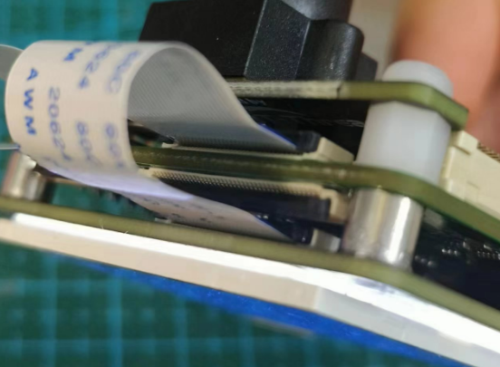
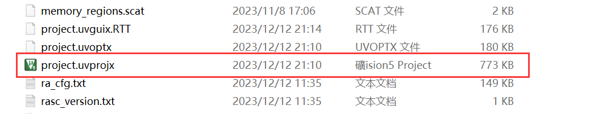

# vision_board_mipi_2.0inch_arm2d 示例说明

## 简介

本例程主要功能是测试 2.0 寸 MIPI 屏幕，通过测试命令可以在 LCD 屏幕上显示不同颜色。

## 硬件说明

* Vision-Board 开发板
* [屏幕拓展板/套餐](https://item.taobao.com/item.htm?_u=t2dmg8j26111&id=765743204571)

MIPI 接口引脚定义如上图所示，需要将屏幕拓展板通过FPC反接排线插入 Vision-Board 的正面MIPI接口中，接线方式见下图：

## 运行

### 编译&下载

#### MDK 方式

1、双击 `mklinks.bat` 文件，执行脚本后会生成 `rt-thread`、`libraries` 两个文件夹：

2、编译固件

双击 **project.uvprojx** 文件打开MDK工程

点击下图按钮进行项目全编译：

3、烧录固件

将开发板的 Dap-Link USB 口与 PC 机连接，然后将固件下载至开发板。

## 运行效果

* 打开 Dap-Link 虚拟出的串口终端，波特率为115200，当用手触摸显示屏时，坐标点位会在串口终端中显示。
* 串口终端中输入 `lcd_test` 指令后，LCD会以红、绿、蓝三个颜色分别刷新显示。

## QA

Q：遇到在使用 Dap-Link 时找不到目标芯片的情况并且无法下载：

A1：方法一：**由于 JTAG/SWD 在芯片出厂时首次使用是加锁的**。请按住开发板的RST按键（正面右一）不松手。再次点击MDK下载按钮后，快速松开RST按键即可。后续无需重复以上操作。

A2：方法二：使用  [Renesas Flash Programmer](https://www.renesas.com/us/en/software-tool/renesas-flash-programmer-programming-gui#documents) 烧录工具进行第一次烧录，操作方法如下：

