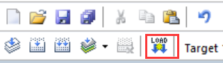

# 毁灭战士游戏Doom例程

## 简介

本例程主要功能为90年代毁灭战士游戏Doom(Doom在电子游戏界中被普遍视作第一人称射击游戏的开拓者之一)的移植。

## 硬件说明

* Vision Board 开发板
* 4.3寸正点原子RGB屏幕
* SD卡（*FAT32*格式）
* 需拷贝 `board/ports/doom/games` 下的游戏文件（任选其一）到SD卡的 doom 文件夹下（没有请先创建doom文件夹）

## 软件说明

启动doom游戏的源代码位于 `/projects/vision_board_rgb_4.3inch_doom/src/hal_entry.c` 中。

### 编译&下载

#### MDK 方式

1、双击 `mklinks.bat` 文件，执行脚本后会生成 `rt-thread`、`libraries` 两个文件夹：

2、编译固件

双击 **project.uvprojx** 文件打开MDK工程

点击下图按钮进行项目全编译：

3、烧录固件

将开发板的 Dap-Link USB 口与 PC 机连接，然后将固件下载至开发板。

## 运行效果

系统会等待SD卡挂载成功，成功后会自动启动运行游戏：

## QA

Q：遇到在使用 Dap-Link 时找不到目标芯片的情况并且无法下载：

A1：方法一：**由于 JTAG/SWD 在芯片出厂时首次使用是加锁的**。请按住开发板的RST按键（正面右一）不松手。再次点击MDK下载按钮后，快速松开RST按键即可。后续无需重复以上操作。

A2：方法二：使用  [Renesas Flash Programmer](https://www.renesas.com/us/en/software-tool/renesas-flash-programmer-programming-gui#documents) 烧录工具进行第一次烧录，操作方法如下：

