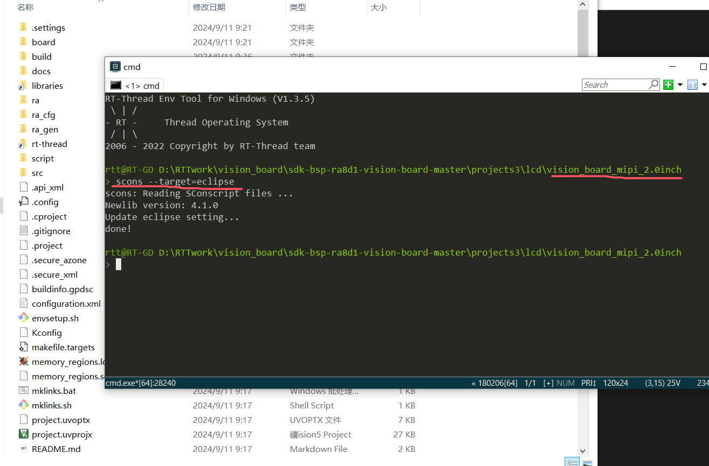
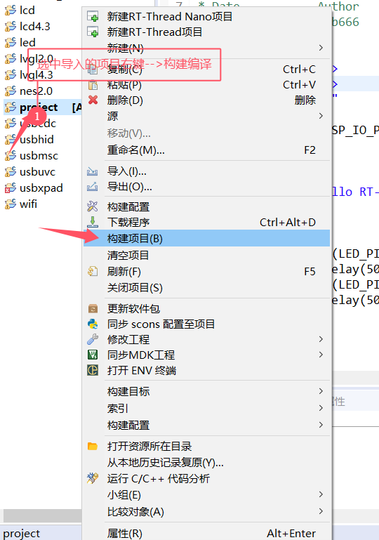
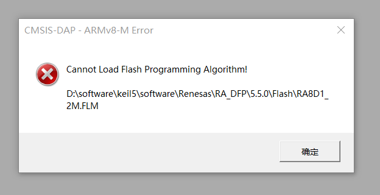

# Vision-board-rgb-4.3inch-lvgl 示例说明

## 简介

LVGL 是一个免费的开源嵌入式图形库，它提供创建嵌入式 GUI 所需的功能，具有易于使用的图形元素、精美的视觉效果和低内存占用。

本例程是在 Vision-Board 开发板平台运行 LVGL9.0 图形库示例的 Demo。

## 硬件说明

* 正点原子 4.3寸 RGB 屏幕
* Vision-Board 开发板

将正点原子 4.3寸 RGB 屏幕与 Vision-Board 开发板通过 40pin fpc 反接排线连接。

硬件连接示意图如下：

## 软件说明

对接 LVGL 触摸部分的代码位于 `vision_board_rgb_4.3inch_lvgl\board\lvgl\lv_port_indev.c` ；

对接 LVGL 显示部分的代码位于 `vision_board_rgb_4.3inch_lvgl\board\lvgl\lv_port_disp.c` ；

如需修改LVGL的配置信息可以在 `vision_board_rgb_4.3inch_lvgl\board\lvgl\lv_conf.h` 中手动修改/添加。

## 运行

### 编译&下载

#### MDK 方式

1、双击 `mklinks.bat` 文件，执行脚本后会生成 `rt-thread`、`libraries` 两个文件夹：

2、编译固件

双击 **project.uvprojx** 文件打开MDK工程

点击下图按钮进行项目全编译：

3、烧录固件

将开发板的 Dap-Link USB 口与 PC 机连接，然后将固件下载至开发板。

#### RT-Thread Studio方式

双击mklinks.bat，会产生两个文件夹libraries和rt-rthread

在当前项目路径下打开env，在env中输入scons --target=eclipse

打开RT-Thread Studio，左上角菜单栏，文件-->导入

## 运行效果

固件烧录完毕后，系统正常运行，默认运行的是 LVGL 的 stress Demo。

## 运行其他Demo

* RT-Thread 为 Vision-Board 适配了许多 LVGL demo，大家后续添加 Demo 也可以按照如下方式添加。

1、打开 env 终端，进入 → Hardware Drivers Config → On-chip Peripheral Drivers 中，选择使能 LVGL Demo；

2、输入回车键，进入菜单选项，选择想运行的 Demo，然后按Esc键返回并保存配置；

3、在终端中输入 `scons --target=mdk5` 生成工程；

4、编译、烧录查看现象；

## QA

Q：遇到在使用 Dap-Link 时找不到目标芯片的情况并且无法下载：

A1：方法一：**由于 JTAG/SWD 在芯片出厂时首次使用是加锁的**。请按住开发板的RST按键（正面右一）不松手。再次点击MDK下载按钮后，快速松开RST按键即可。后续无需重复以上操作。

A2：方法二：使用  [Renesas Flash Programmer](https://www.renesas.com/us/en/software-tool/renesas-flash-programmer-programming-gui#documents) 烧录工具进行第一次烧录，操作方法如下：

**Q:  遇到编译报错（MDK）：**

问题：找不到hal_entry函数

**A:**  解决方法：hal_entry函数定义在src文件夹下，在mdk中从新把这个文件添加进去后编译即可解决

**Q:  下载报错（MDK）：**

**A:**  解决方法：

