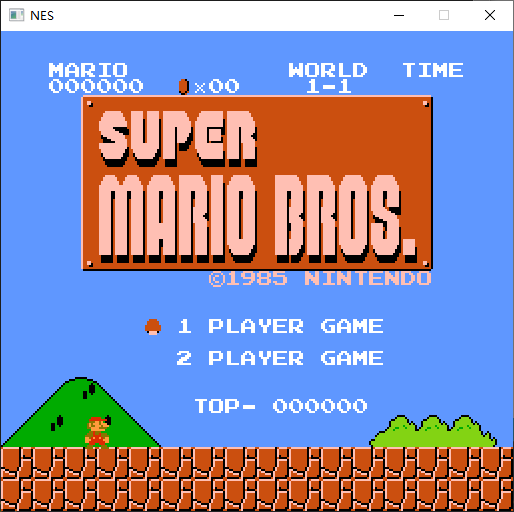
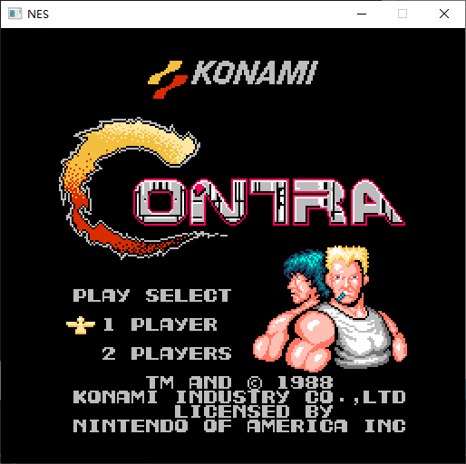

**English** | [中文](./README_zh.md) 

# nes

#### Introduction
The nes simulator implemented in c , requires c11

**attention：**

**This repository is only for the nes simulator and does not provide the game ！！！**

Support：

- [x] CUP

- [x] PPU

- [ ] APU

mapper  support：0，2

#### Software Architecture
The example is based on SDL2 for image and sound output, without special dependencies, and you can port to any hardware by yourself

#### Compile Tutorial

​	clone repository，install[xmake](https://github.com/xmake-io/xmake)  ，execute `xmake` directly to compile

#### Instructions

​	on linux enter  `./nes xxx.nes` load the game to run
​	on windows enter `.\nes.exe xxx.nes` load the game to run

#### Key mapping

| joystick |  up  | down | left | right | select | start |  A   |  B   |
| :------: | :--: | :--: | :--: | :---: | :----: | :---: | :--: | :--: |
|    P1    |  W   |  S   |  A   |   D   |   V    |   B   |  J   |  K   |
|    P2    |  ↑   |  ↓   |  ←   |   →   |   1    |   2   |  5   |  6   |

#### showcase

#### Literature reference

https://www.nesdev.org/

