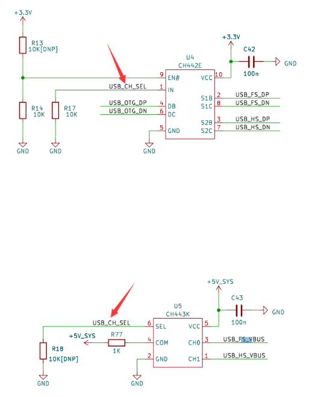
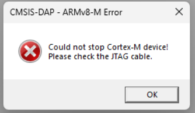
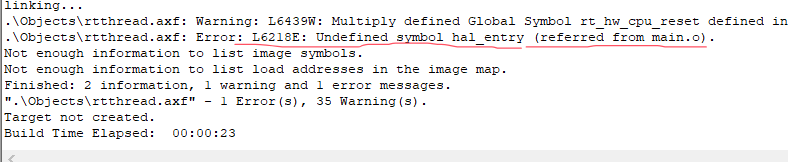
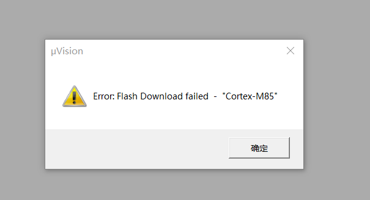
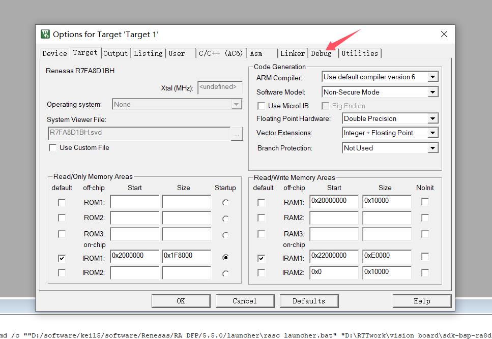

# vision_board_tinyusb_cdc 例程

## 简介

本例程主要功能是最小tinyusb工程。 这个例程也可以做为您的创作的基础usb工程，该实例默认会在windows下虚拟一个串口设备。

## 硬件说明

硬件电路上需要对USB_CH_SEL引脚进行处理才能切换USBFS-HS，默认拉低，拉高为切换HS

## 软件说明

在tinyusb_port.c中完成了tinyusb的初始化：

在drv_tinyusb.c中完成了fs-hs的切换以及中断的处理：

## 运行

### 编译&下载

#### MDK 方式

1、双击 `mklinks.bat` 文件，执行脚本后会生成 `rt-thread`、`libraries` 两个文件夹：

2、编译固件

双击 **project.uvprojx** 文件打开MDK工程

点击下图按钮进行项目全编译：

3、烧录固件

将开发板的 Dap-Link USB 口与 PC 机连接，然后将固件下载至开发板。

#### RT-Thread Studio方式

双击mklinks.bat，会产生两个文件夹libraries和rt-rthread

在当前项目路径下打开env，在env中输入scons --target=eclipse

打开RT-Thread Studio，左上角菜单栏，文件-->导入

## 运行效果

正常运行后，设备管理器会弹出一个端口设备，然后在串口终端打开这个端口，串口终端输入cdc_example后，会打印：please enter something:

然后向串口发送的数据会回显一次

## QA

Q：遇到在使用 Dap-Link 时找不到目标芯片的情况并且无法下载：

A1：方法一：**由于 JTAG/SWD 在芯片出厂时首次使用是加锁的**。请按住开发板的RST按键（正面右一）不松手。再次点击MDK下载按钮后，快速松开RST按键即可。后续无需重复以上操作。

A2：方法二：使用  [Renesas Flash Programmer](https://www.renesas.com/us/en/software-tool/renesas-flash-programmer-programming-gui#documents) 烧录工具进行第一次烧录，操作方法如下：

**Q:  遇到编译报错（MDK）：**

问题：找不到hal_entry函数

**A:**  解决方法：hal_entry函数定义在src文件夹下，在mdk中从新把这个文件添加进去后编译即可解决

**Q:  下载报错（MDK）：**

**A:**  解决方法：

