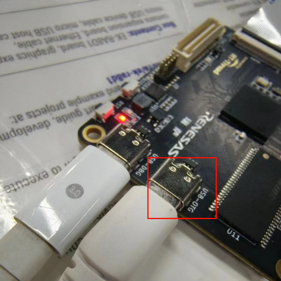
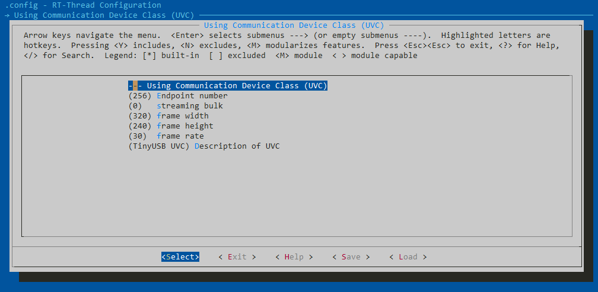
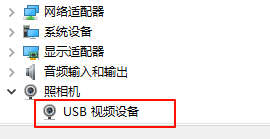
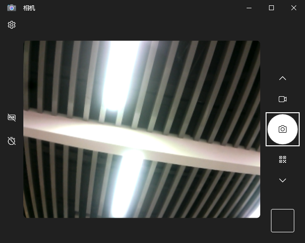
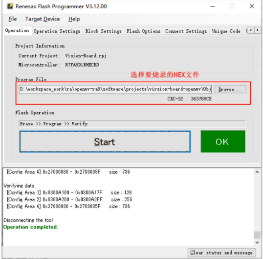

# vision_board_tinyusb_uvc 例程

## 简介

本例程主要功能是tinyusb-uvc工程，实现了在windows下将开发板作为摄像头设备，可以打开摄像头软件进行查看。

## 硬件说明

硬件电路上需要对USB_CH_SEL引脚进行处理才能切换USBFS-HS，默认拉低，拉高为切换HS

## 软件说明

在tinyusb_port.c中完成了tinyusb的初始化：

可以在ENV中可以对UVC设备进行配置，默认配置为QVGA分辨率30HZ

## 运行

### 编译&下载

#### MDK 方式

1、双击 `mklinks.bat` 文件，执行脚本后会生成 `rt-thread`、`libraries` 两个文件夹：

2、编译固件

双击 **project.uvprojx** 文件打开MDK工程

点击下图按钮进行项目全编译：

3、烧录固件

将开发板的 Dap-Link USB 口与 PC 机连接，然后将固件下载至开发板。

## 运行效果，

正常运行后，设备管理器会弹出一个摄像头设备，打开相机APP可以查看摄像头捕获的画面信息。

**注意：如果下载程序后发下无法正常显示画面，要重新打开一次相机APP**

## QA

Q：遇到在使用 Dap-Link 时找不到目标芯片的情况并且无法下载：

A1：方法一：**由于 JTAG/SWD 在芯片出厂时首次使用是加锁的**。请按住开发板的RST按键（正面右一）不松手。再次点击MDK下载按钮后，快速松开RST按键即可。后续无需重复以上操作。

A2：方法二：使用  [Renesas Flash Programmer](https://www.renesas.com/us/en/software-tool/renesas-flash-programmer-programming-gui#documents) 烧录工具进行第一次烧录，操作方法如下：

