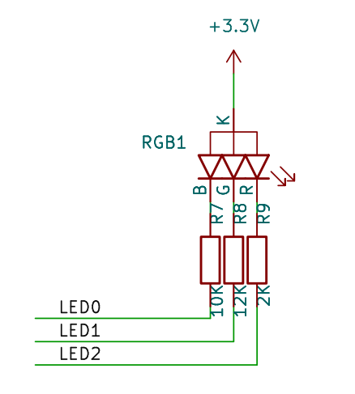
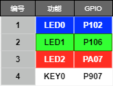
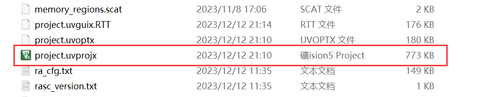

# LED闪烁例程

## 简介

本例程主要功能是让板载的 RGB-LED 中的蓝色 LED 不间断闪烁。 这个例程也可以做为您的创作的基础工程。

## 硬件说明





如上图所示，RGB-LED 属于共阳 LED， **阴极** 分别与单片机的引脚相连，其中蓝色 LED 对应 P102 引脚。单片机引脚输出低电平即可点亮 LED，输出高电平则会熄灭 LED。

## 软件说明

闪灯的源代码位于 `/projects/vision-board-blink-led/src/hal_entry.c` 中。首先定义了一个宏 `LED_PIN` ，代表闪灯的 LED 引脚编号，然后与 `BSP_IO_PORT_01_PIN_02`（**P102 **）对应：

```
#define LED_PIN    BSP_IO_PORT_01_PIN_02 /* Onboard LED pins */
```

在 main 函数中，将该引脚配置为输出模式，并在下面的 while 循环中，周期性（500毫秒）开关 LED。

```
void hal_entry(void)
{
    rt_kprintf("\nHello RT-Thread!\n");

    while (1)
    {
        rt_pin_write(LED_PIN, PIN_HIGH);
        rt_thread_mdelay(500);
        rt_pin_write(LED_PIN, PIN_LOW);
        rt_thread_mdelay(500);
    }
}
```

## 运行

### 编译&下载

#### MDK 方式

1、双击 `mklinks.bat` 文件，执行脚本后会生成 `rt-thread`、`libraries` 两个文件夹：


2、编译固件

双击 **project.uvprojx** 文件打开MDK工程



点击下图按钮进行项目全编译：


3、烧录固件

将开发板的 Dap-Link USB 口与 PC 机连接，然后将固件下载至开发板。


## 运行效果

正常运行后，蓝色 LED 会周期性闪烁。

## 注意事项

如果想要修改`LED_PIN` 宏定义，可以通过 GET_PIN 来修改。
