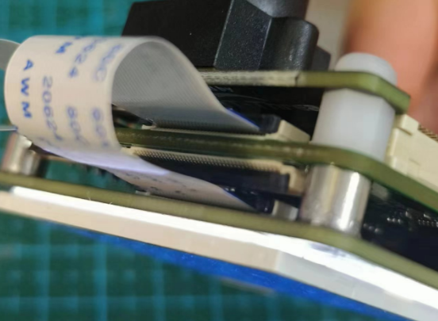
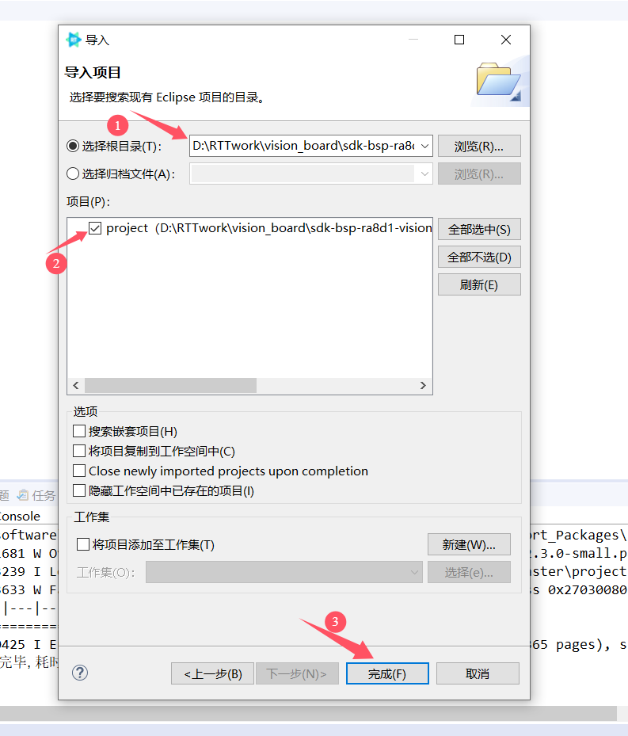
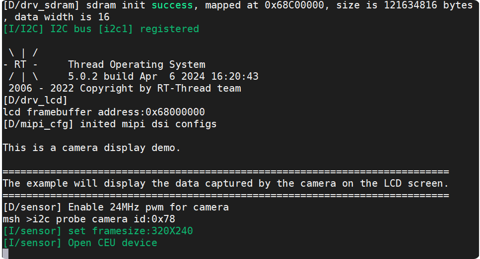
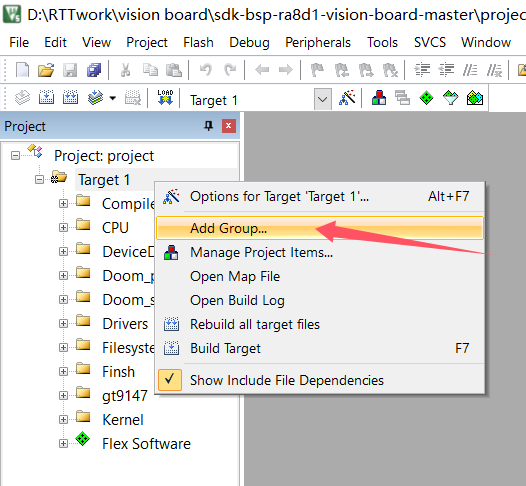
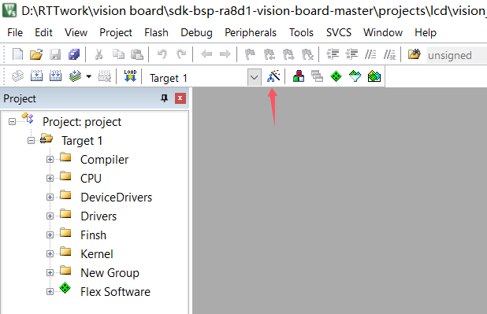
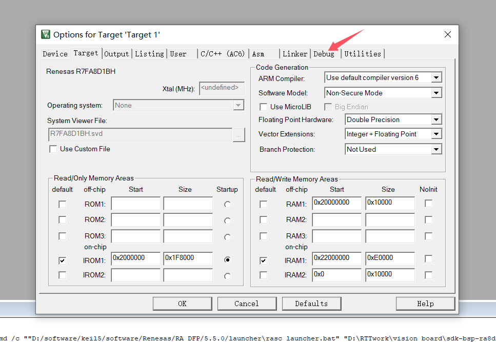
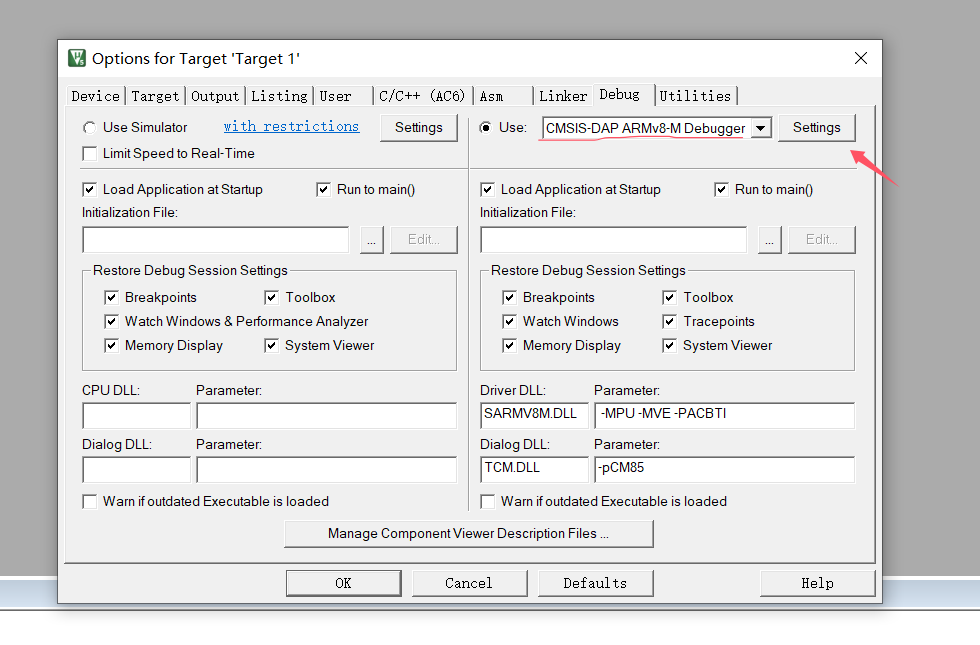

# vision_board_camera 示例说明

## 简介

本例程主要功能是摄像头捕获示例，开发板会上电将摄像头捕获的数据显示在LCD屏幕上。

## 硬件说明

* Vision-Board 开发板
* [屏幕拓展板/套餐](https://item.taobao.com/item.htm?_u=t2dmg8j26111&id=765743204571)

MIPI 接口引脚定义如上图所示，需要将屏幕拓展板通过FPC反接排线插入 Vision-Board 的正面MIPI接口中，接线方式见下图：

## 运行

### 编译&下载

#### MDK 方式

1、双击 `mklinks.bat` 文件，执行脚本后会生成 `rt-thread`、`libraries` 两个文件夹：

2、编译固件

双击 **project.uvprojx** 文件打开MDK工程

点击下图按钮进行项目全编译：

3、烧录固件

将开发板的 Dap-Link USB 口与 PC 机连接，然后将固件下载至开发板。

#### RT-Thread Studio方式

双击mklinks.bat，会产生两个文件夹libraries和rt-rthread

在当前项目路径下打开env，在env中输入scons --target=eclipse

打开RT-Thread Studio，左上角菜单栏，文件-->导入

## 运行效果

* 打开 Dap-Link 虚拟出的串口终端，波特率为115200，代码会自动检测插入的摄像头并进行初始化，然后开始捕获RGB数据。

* 此时幕拓展板上，会显示摄像头捕获到的画面

## QA

Q：遇到在使用 Dap-Link 时找不到目标芯片的情况并且无法下载：

A1：方法一：**由于 JTAG/SWD 在芯片出厂时首次使用是加锁的**。请按住开发板的RST按键（正面右一）不松手。再次点击MDK下载按钮后，快速松开RST按键即可。后续无需重复以上操作。

A2：方法二：使用  [Renesas Flash Programmer](https://www.renesas.com/us/en/software-tool/renesas-flash-programmer-programming-gui#documents) 烧录工具进行第一次烧录，操作方法如下：

**Q:  遇到编译报错（MDK）：**

问题：找不到hal_entry函数

**A:**  解决方法：hal_entry函数定义在src文件夹下，在mdk中从新把这个文件添加进去后编译即可解决

**Q:  下载报错（MDK）：**

**A:**  解决方法：

