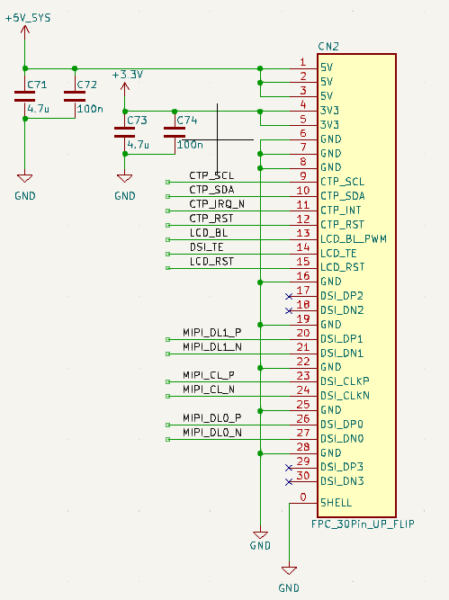
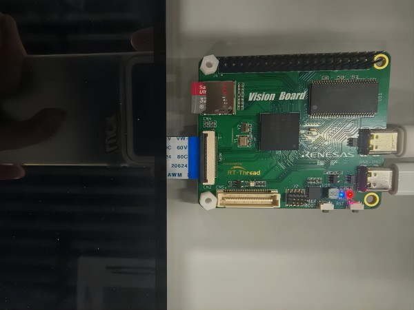

# vision_board-mipi_7.0inch 示例说明

## 简介

本例程主要功能是测试 7.0 寸 mipi 屏幕，通过测试命令可以在 LCD 屏幕上显示不同颜色。

## 硬件说明

* Vision-Board 开发板
* [野火7.0寸](https://doc.embedfire.com/products/link/zh/latest/module/screen/ebf_lcd_mipi_5.5_7_10.1.html#mipi-7)mipi屏幕

mipi接口引脚定义如上图所示，需要将7寸屏幕通过FPC反接排线插入 Vision-Board 的正面mipi接口中，接线方式见下图：

## 软件说明

触摸部分的代码位于 `/projects/vision_board-mipi_7.0inch/src/hal_entry.c` 中。在 hal_entry 中主要对野火的7寸屏幕进行了初始化，并单独开辟了一个线程用于测试读取触摸坐标点。

mipi 屏幕初始化配置代码位于： `vision_board-mipi_7.0inch\board\ports\mipi_lcd\mipi_config.c` 中。其中包括了对mipi屏幕参数的初始化。

## 运行

### 编译&下载

#### MDK 方式

1、双击 `mklinks.bat` 文件，执行脚本后会生成 `rt-thread`、`libraries` 两个文件夹：

2、编译固件

双击 **project.uvprojx** 文件打开MDK工程

点击下图按钮进行项目全编译：

3、烧录固件

将开发板的 Dap-Link USB 口与 PC 机连接，然后将固件下载至开发板。

## 运行效果

* 打开 Dap-Link 虚拟出的串口终端，波特率为115200，当用手触摸显示屏时，坐标点位会在串口终端中显示。
* 串口终端中输入 `lcd_test` 指令后，LCD会以红、绿、蓝三个颜色分别刷新显示。
