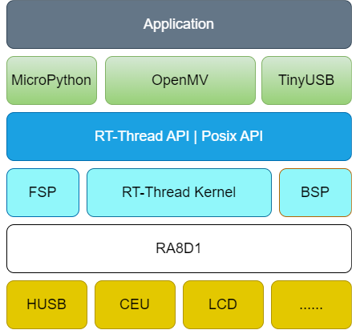
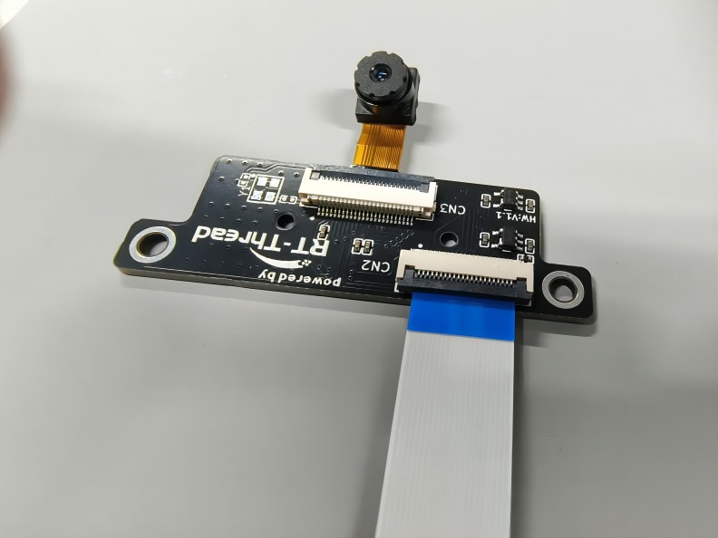
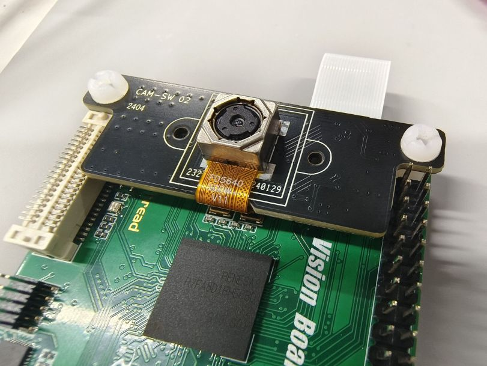
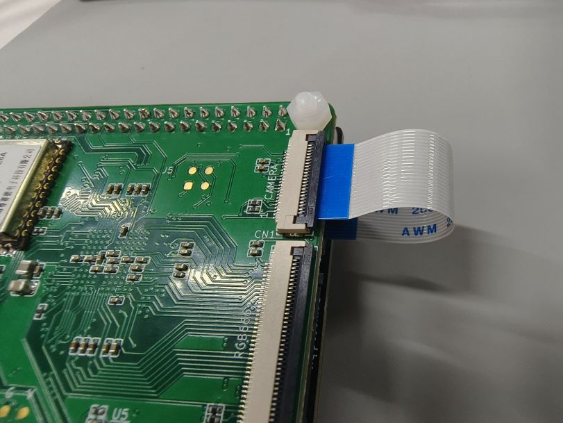
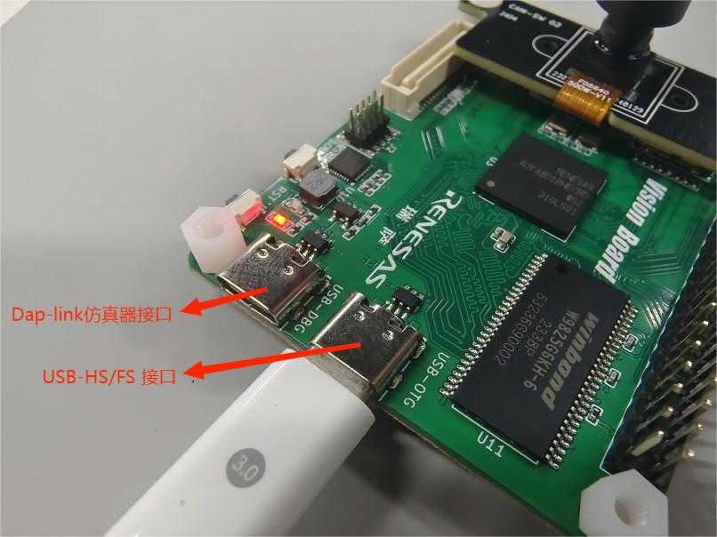
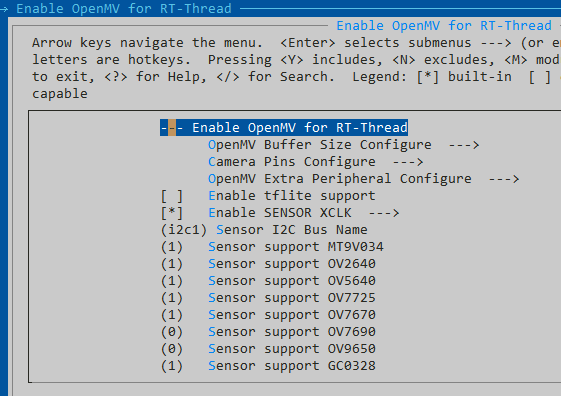
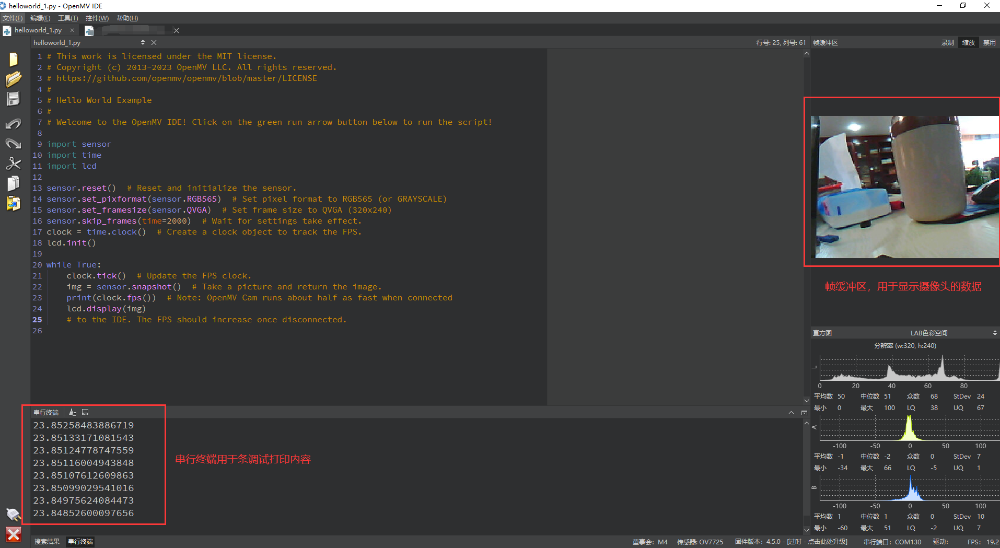
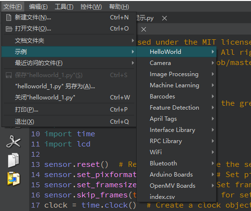

# OpenMV 例程

## 简介

OpenMV 是由美国克里斯团队基于 MicroPython 发起的开源机器视觉项目，目的是创建低成本，可扩展，使用 python 驱动的机器视觉模块。OpenMV 搭载了 MicroPython 解释器，使其可以在嵌入式端进行 python 开发，基于 OpenMV 可以进行多种机器视觉应用的实现，比如人脸检测，物体分类等。目前 OpenMV 也被广泛的应用于国内外高校的竞赛中。

本参考设计为嵌入式AI 爱好者以及高校提供了一套快速简洁的模型验证方法：基于 **Micropython** 环境使用 python 语言开发并验证机器视觉等算法。

## 系统框架

## 硬件连接说明

硬件清单：

* 已支持的摄像头型号：ov2640、ov7725、ov5640、ov7670、gc0328
* 摄像头转接板
* 屏幕拓展板（选配）
* USB电缆x2

以下是开发板的连接示意图：

**摄像头部分示意图**：

**USB部分示意图**：

## 软件使用说明

### 软件环境

* MDK＞= 5.38版本
* RT-Thread [ENV](https://download_redirect.rt-thread.org/download/env_release/env_released_1.3.5.7z) 配置工具
* Renesas [FSP5.1.0](https://github.com/renesas/fsp/releases/download/v5.1.0/setup_fsp_v5_1_0_rasc_v2023-10.exe)版本

支持 ENV 配置 OpenMV 基本信息，包括：frambuffer、摄像头引脚、摄像头型号等。

### 编译

双击 **project.uvprojx** 文件打开MDK工程

点击下图按钮进行项目全编译：

### 烧录

点击下图按钮进行固件烧录：

## OpenMV 使用说明

到目前为止，Vision Board 已经成为了可以运行 OpenMV 的开发板，接下来介绍下如何使用它连接 OpenMV IDE 运行我们第一个Hello World 程序。

### 环境准备

请自行安装 OpenMV IDE：

* [OpenMV IDE-4.0.14版本](https://github.com/openmv/openmv-ide/releases/download/v4.0.14/openmv-ide-windows-4.0.14.exe) 

### 运行Hello World 程序

1、点击左下角的连接设备按钮，等待连接成功

2、点击连接下面的运行按钮，即可运行编码区域的 Micropython 代码，下图是一些常用的功能区域说明：

3、OpenMV IDE 还有很多示例，大家可以自行体验：

**注：更多的示例以及教程可以详见 [OpenMV 文档中心](https://book.openmv.cc/)**
