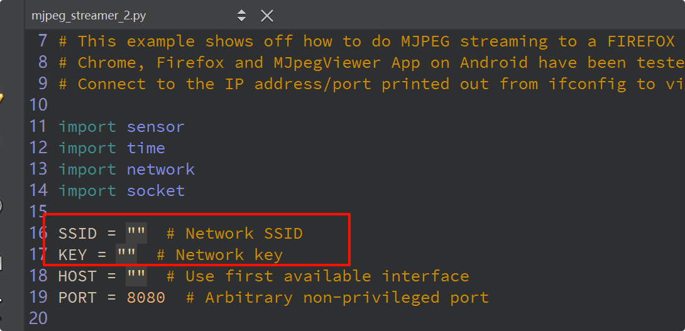

# OpenMV 例程

## 简介

OpenMV 是由美国克里斯团队基于 MicroPython 发起的开源机器视觉项目，目的是创建低成本，可扩展，使用 python 驱动的机器视觉模块。OpenMV 搭载了 MicroPython 解释器，使其可以在嵌入式端进行 python 开发，基于 OpenMV 可以进行多种机器视觉应用的实现，比如人脸检测，物体分类等。目前 OpenMV 也被广泛的应用于国内外高校的竞赛中。

本参考设计为嵌入式AI 爱好者以及高校提供了一套快速简洁的模型验证方法：基于 **Micropython** 环境使用 python 语言开发并验证机器视觉等算法。

## 系统框架

## 硬件连接说明

硬件清单：

* 已支持的摄像头型号：ov2640、ov7725、ov5640、ov7670、gc0328
* 摄像头转接板
* 屏幕拓展板（选配）
* USB电缆x2

以下是开发板的连接示意图：

**摄像头部分示意图**：

**USB部分示意图**：

## 软件使用说明

### 软件环境

* MDK＞= 5.38版本
* RT-Thread [ENV](https://download_redirect.rt-thread.org/download/env_release/env_released_1.3.5.7z) 配置工具
* Renesas [FSP5.1.0](https://github.com/renesas/fsp/releases/download/v5.1.0/setup_fsp_v5_1_0_rasc_v2023-10.exe)版本

支持 ENV 配置 OpenMV 基本信息，包括：frambuffer、摄像头引脚、摄像头型号等。

### 编译

双击 `mklinks.bat` 文件，执行脚本后会生成 `rt-thread`、`libraries` 两个文件夹：

双击 **project.uvprojx** 文件打开MDK工程

点击下图按钮进行项目全编译：

### 烧录

点击下图按钮进行固件烧录：

## RT-Thread Studio 编译说明

如果您想使用 RT-Thread Studio 创建并编译 OpenMV 工程，需要严格按照以下步骤进行：

1. 在 Studio 的 SDK-Manager 中下载最新的 Vision Board 开发板支持包（必须≥1.1.0版本）

2. 需要在 Studio 中切换到 Github 下载源

   

3. 下载V13.2.1版本GCC工具链

   

4. 使能解除命令行长度限制：

   

5. 接下来就可以愉快的编译烧录了

## OpenMV 使用说明

到目前为止，Vision Board 已经成为了可以运行 OpenMV 的开发板，接下来介绍下如何使用它连接 OpenMV IDE 运行我们第一个Hello World 程序。

### 环境准备

请自行安装 OpenMV IDE：

* [OpenMV IDE-4.0.14版本](https://github.com/openmv/openmv-ide/releases/download/v4.0.14/openmv-ide-windows-4.0.14.exe) 

### 运行Hello World 程序

1、点击左下角的连接设备按钮，等待连接成功

2、点击连接下面的运行按钮，即可运行编码区域的 Micropython 代码，下图是一些常用的功能区域说明：

3、OpenMV IDE 还有很多示例，大家可以自行体验：

**注：更多的示例以及教程可以详见 [OpenMV 文档中心](https://book.openmv.cc/)**

## 使能TF-micro功能

目前Vision-Board已经支持TF-micro（神经网络）功能，但默认没有开启，用户可以选择开启/关闭选项，接下来介绍如何开启此功能：

1. 打开ENV终端，输入`menuconfig`进入配置界面
2. 进入`Enable OpenMV for RT-Thread`菜单，使能`Enable tflite support`选项即可
3. 退出ENV并保存配置
4. 输入：`scons --target=mdk5`生成工程

## OpenMV-WiFi 图传功能

目前固件支持了两种使用 HTTP 协议图传方式

* STA 模式
* AP 模式

### STA模式

打开 openmv ide，选择文件—>示例—>WiFi—>mjpeg_streamer.py

* SSID ：填写要连接的wifi名称信息（**只能是2.4G频段的wifi**）

* KEY  ：填写要连接的wifi密码信息

* 最后点击运行脚本，然后确保查看图像的设备和 vision board 处于同一网段（即：可以相互 ping 通）；
* 当 vision board 成功连接到热点后，会打印获取到的ip地址；

当然在 vision board 的串口终端中也可以同样查看到ip地址等信息：

* 复制这个ip地址到浏览器中打开，端口号为 8080。例如：http://192.168.31.182:8080，就可以查看到图像数据啦

### AP 模式

打开 openmv ide，选择文件—>示例—>WiFi—>mjpeg_streamer_ap.py

* 最后点击运行脚本，然后将要查看图像的设备连接名称为 `OPENMV_AP` 的wifi热点，密码为：`1234567890`：

连接成功后，会弹出无法访问 Internet，这是正常现象因为 vision board 的网卡此时是作为AP设备：

* 此时在浏览器访问默认 http://192.168.1.1:8080 ，就可以查看到图像数据啦

## 如何使能虚拟U盘功能

进入  `RT-Thread online packages → system packages → TinyUSB: an open source cross-platform USB stack for embedded system → Using USB device` 路径下，使能 **Using Mass Storage Class (MSC)**

进入 Using Mass Storage Class (MSC) ，将最后一项改成 sd；

* 退出menuconfig菜单，并保存配置，然后使用 scons --target=mdk5 （如果是mdk方式）重新生成工程；

* 编译，烧录固件到开发板中；
* 硬件上：需要插入SD卡到开发板中

**注意：（已知问题）使能USB复合设备后，每次第一次上电需要先等待弹出U盘后再连接 OpenMV IDE！！否则会卡死！！**

## 待办事项

目前 OpenMV 待支持功能：

- [ ] RW007 Wi-Fi 图传功能
- [ ] MSC-USB 复合设备（虚拟U盘功能）

## QA

### Q1：使用OpenMV IDE连接时传输摄像头画面偶尔“闪烁”一下：

> 我们测试过有的电脑会确实出现这个问题，具体原因未知，但并不影响正常使用。欢迎有能力的小伙伴帮忙修复！

A：解决办法：请更新github的最新固件。

### Q2：遇到在使用 Dap-Link 时找不到目标芯片的情况并且无法下载：

A1：方法一：**由于 JTAG/SWD 在芯片出厂时首次使用是加锁的**。请按住开发板的RST按键（正面右一）不松手。再次点击MDK下载按钮后，快速松开RST按键即可。后续无需重复以上操作。

A2：方法二：使用  [Renesas Flash Programmer](https://www.renesas.com/us/en/software-tool/renesas-flash-programmer-programming-gui#documents) 烧录工具进行第一次烧录，操作方法如下：

