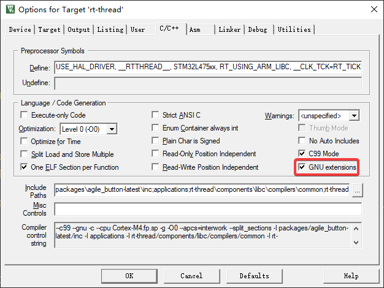
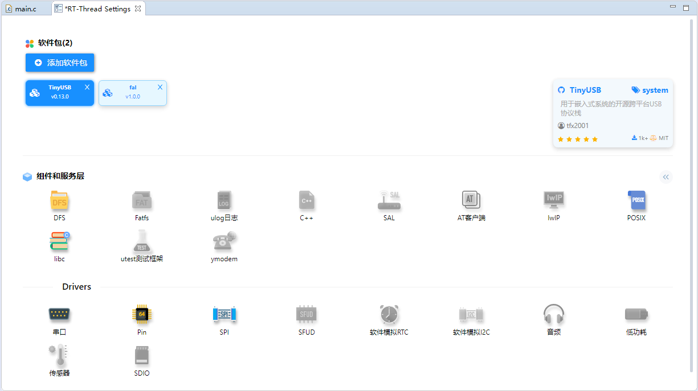

TinyUSB for RT-Thread Port
==========================

[中文](./README_ZH.md) | English

TinyUSB is an open source cross-platform USB stack for embedded system.

1 Getting Start
----------------

### 1.1 ENV

The specific path in RT-Thread ENV package manager is as follows:

``` {.sourceCode .text}
-> RT-Thread online packages
    -> system packages
        --- TinyUSB: an open source cross-platform USB stack for embedded system
        (2048) TinyUSB thread stack size                                        
        (8)   TinyUSB thread priority                                           
        (.data) Memory section name                                             
        (4)   Memory align size                                                 
            Port number (1)  --->                                             
            Port speed (Full Speed)  --->                                     
        [*]   Using USB device  --->                                            
            TinyUSB debug level (No debug)  --->                              
            Version (v0.13.0)  --->                                            
```

Then let the RT-Thread package manager automatically update, or use the
`pkgs --update` command to update the package to the BSP.

**Note:** For use in Keil MDK, please use the **ARM Clang** compiler or manually check **GNU Extensions** in the compile options.



### 1.2 RT-Thread Studio

Search for `TinyUSB` in RT-Thread Settings to add the package to the project.



2 Support
-----------

### 2.1 MCU

- STM32 series
- nRF52840
- HPM6000 series

### 2.2 Device Stack

- Communication Device Class (CDC)
- Mass Storage Class (MSC)
- Human Interface Device (HID)

# 3 Feedback

Issue: [RT-Thread-packages/tinyusb](https://github.com/RT-Thread-packages/tinyusb/issues)
