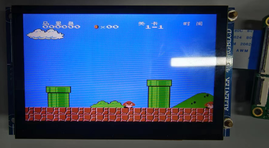

# vision_board_rgb_4.3inch_nes 示例说明

## 简介

本例程主要功能介绍了在vision_board开发板上移植 nes 模拟器的方法。

本例程使用到了 LCD 显示 nes 模拟器。使用 sd 卡来存储游戏。

注：当前工程仅实现了显示接口，触摸控制逻辑待加入

## 硬件说明

* Vision-Board 开发板
* [正点原子4.3寸](http://www.openedv.com/docs/modules/lcd/4.3-RGBLCD-800480.html)RGB屏幕
* SD卡（*FAT32*格式）
* 需拷贝 `board/ports/nes/games` 下的游戏文件（任选其一）到SD卡的 nes 文件夹下（没有请先创建nes文件夹）


RGB接口引脚定义如上图所示，需要将4.3寸屏幕通过FPC反接排线插入 Vision-Board 的正面RGB接口中，接线方式见下图：



## 软件说明

本例程的源码位于 `/projects/vision_board_rgb_4.3inch_nes`。nes 的移植代码主要在 board/ports/nes 文件夹下。

其中 board/ports/nes/port/nes_port.c 为移植的内容

```
int nes_draw(size_t x1, size_t y1, size_t x2, size_t y2, nes_color_t *color_data)
{
    SCB_CleanInvalidateDCache_by_Addr((uint32_t *)color_data, sizeof(fb_background[0]));

    extern void lcd_gpu_fill_array(size_t x1, size_t y1, size_t x2, size_t y2, uint16_t *color_data);
    lcd_gpu_fill_array(x1, y1, x2, y2, color_data);

    return 0;
}
```

上面的函数实现了屏幕显示。

## 运行

### 编译&下载

#### MDK 方式

1、双击 `mklinks.bat` 文件，执行脚本后会生成 `rt-thread`、`libraries` 两个文件夹：


2、编译固件

双击 **project.uvprojx** 文件打开MDK工程


点击下图按钮进行项目全编译：


3、烧录固件

将开发板的 Dap-Link USB 口与 PC 机连接，然后将固件下载至开发板。


## 运行效果

* 打开 Dap-Link 虚拟出的串口终端，波特率为115200。
* 烧录好后，上电系统会自动运行nes游戏，默认超级马里奥游戏。

## QA

Q：遇到在使用 Dap-Link 时找不到目标芯片的情况并且无法下载：


A1：方法一：**由于 JTAG/SWD 在芯片出厂时首次使用是加锁的**。请按住开发板的RST按键（正面右一）不松手。再次点击MDK下载按钮后，快速松开RST按键即可。后续无需重复以上操作。

A2：方法二：使用  [Renesas Flash Programmer](https://www.renesas.com/us/en/software-tool/renesas-flash-programmer-programming-gui#documents) 烧录工具进行第一次烧录，操作方法如下：


