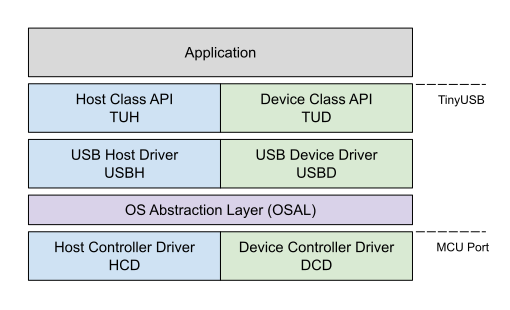

# TinyUSB for RT-Thread

### [中文文档](https://www.rt-thread.org/document/site/#/rt-thread-version/rt-thread-standard/packages-manual/tinyusb-docs/introduction)

TinyUSB is an open-source cross-platform USB Host/Device stack for
embedded system, designed to be memory-safe with no dynamic allocation
and thread-safe with all interrupt events are deferred then handled in
the non-ISR task function.

Please take a look at the online
[documentation](https://docs.tinyusb.org/).

<figure>

</figure>

    .
    ├── docs            # Documentation
    ├── examples        # Sample with Makefile build support
    ├── hw
    │   ├── bsp         # Supported boards source files
    │   └── mcu         # Low level mcu core & peripheral drivers
    ├── lib             # Sources from 3rd party such as freeRTOS, fatfs ...
    ├── src             # All sources files for TinyUSB stack itself.
    ├── test            # Unit tests for the stack
    └── tools           # Files used internally

Supported MCUs
==============

The stack supports the following MCUs:

-   **Allwinner:** F1C100s/F1C200s
-   **Broadcom:** BCM2837, BCM2711
-   **Dialog:** DA1469x
-   **Espressif:** ESP32-S2, ESP32-S3
-   **GigaDevice:** GD32VF103
-   **Infineon:** XMC4500
-   **MicroChip:** SAMD11, SAMD21, SAMD51, SAME5x, SAMG55, SAML21,
    SAML22, SAME7x
-   **NordicSemi:** nRF52833, nRF52840, nRF5340
-   **Nuvoton:** NUC120, NUC121/NUC125, NUC126, NUC505
-   **NXP:**
    -   iMX RT Series: RT1011, RT1015, RT1021, RT1052, RT1062, RT1064
    -   Kinetis: KL25, K32L2
    -   LPC Series: 11u, 13, 15, 17, 18, 40, 43, 51u, 54, 55
-   **Raspberry Pi:** RP2040
-   **Renesas:** RX63N, RX65N, RX72N
-   **Silabs:** EFM32GG
-   **Sony:** CXD56
-   **ST:** STM32 series: F0, F1, F2, F3, F4, F7, H7, G4, L0, L1, L4,
    L4+
-   **TI:** MSP430, MSP432E4, TM4C123
-   **ValentyUSB:** eptri

Here is the list of [Supported Devices](docs/reference/supported.rst)
that can be used with provided examples.

Device Stack
============

Supports multiple device configurations by dynamically changing USB
descriptors, low power functions such like suspend, resume, and remote
wakeup. The following device classes are supported:

-   Audio Class 2.0 (UAC2)
-   Bluetooth Host Controller Interface (BTH HCI)
-   Communication Device Class (CDC)
-   Device Firmware Update (DFU): DFU mode (WIP) and Runtime
-   Human Interface Device (HID): Generic (In & Out), Keyboard, Mouse,
    Gamepad etc ...
-   Mass Storage Class (MSC): with multiple LUNs
-   Musical Instrument Digital Interface (MIDI)
-   Network with RNDIS, Ethernet Control Model (ECM), Network Control
    Model (NCM)
-   Test and Measurement Class (USBTMC)
-   Video class 1.5 (UVC): work in progress
-   Vendor-specific class support with generic In & Out endpoints. Can
    be used with MS OS 2.0 compatible descriptor to load winUSB driver
    without INF file.
-   [WebUSB](https://github.com/WICG/webusb) with vendor-specific class

If you have a special requirement, `usbd_app_driver_get_cb()` can be used to write
your own class driver without modifying the stack. Here is how the RPi
team added their reset interface
[raspberrypi/pico-sdk#197](https://github.com/raspberrypi/pico-sdk/pull/197)

Host Stack
==========

-   Human Interface Device (HID): Keyboard, Mouse, Generic
-   Mass Storage Class (MSC)
-   Hub currently only supports 1 level of hub (due to my laziness)

OS Abstraction layer
====================

TinyUSB is completely thread-safe by pushing all Interrupt Service
Request (ISR) events into a central queue, then processing them later in
the non-ISR context task function. It also uses semaphore/mutex to
access shared resources such as Communication Device Class (CDC) FIFO.
Therefore the stack needs to use some of the OS's basic APIs. Following
OSes are already supported out of the box.

-   **No OS**
-   **FreeRTOS**
-   [RT-Thread](https://github.com/RT-Thread/rt-thread):
    [repo](https://github.com/RT-Thread-packages/tinyusb)
-   **Mynewt** Due to the newt package build system, Mynewt examples are
    better to be on its [own
    repo](https://github.com/hathach/mynewt-tinyusb-example)

Local Docs
==========

-   Info
    -   [Uses](docs/info/uses.rst)
    -   [Changelog](docs/info/changelog.rst)
    -   [Contributors](CONTRIBUTORS.rst)
-   [Reference](docs/reference/index.rst)
    -   [Supported Devices](docs/reference/supported.rst)
    -   [Getting Started](docs/reference/getting_started.rst)
    -   [Concurrency](docs/reference/concurrency.rst)
-   [Contributing](docs/contributing/index.rst)
    -   [Code of Conduct](CODE_OF_CONDUCT.rst)
    -   [Structure](docs/contributing/structure.rst)
    -   [Porting](docs/contributing/porting.rst)

License
=======

All TinyUSB sources in the `src` folder are licensed under MIT license,
the [Full license is here](LICENSE). However, each file can be
individually licensed especially those in `lib` and `hw/mcu` folder.
Please make sure you understand all the license term for files you use
in your project.
