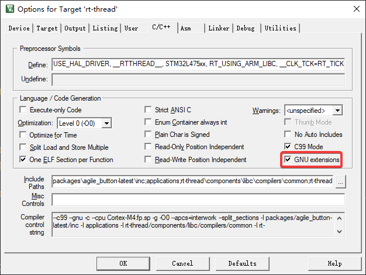
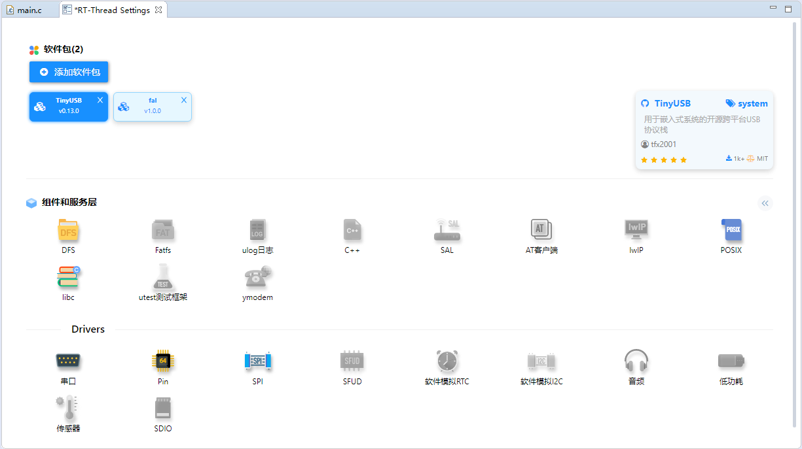

RT-Thread TinyUSB 软件包
==========================

中文 | [English](./README.md)

TinyUSB 是一个用于嵌入式设备的跨平台 USB 协议栈。

1、开始使用 TinyUSB
----------------

### 1.1、ENV

RT-Thread ENV 包管理器中的路径如下：

``` {.sourceCode .text}
-> RT-Thread online packages
    -> system packages
        --- TinyUSB: an open source cross-platform USB stack for embedded system
        (2048) TinyUSB thread stack size                                        
        (8)   TinyUSB thread priority                                           
        (.data) Memory section name                                             
        (4)   Memory align size                                                 
            Port number (1)  --->                                             
            Port speed (Full Speed)  --->                                     
        [*]   Using USB device  --->                                            
            TinyUSB debug level (No debug)  --->                              
            Version (v0.13.0)  --->                                            
```

然后让 RT-Thread 的包管理器自动更新，或者使用 `pkgs --update`
命令更新包到 BSP 中。

**注意：** 在 Keil MDK 中使用时，请选择 **ARM Clang** 编译器，或手动在编译选项中选中 **GNU Extensions**



### 1.2、RT-Thread Studio

在 RT-Thread Settings 中搜索 `TinyUSB` 即可将软件包添加至工程中。



2、支持情况
-----------

### 2.1、MCU

- STM32 系列
- nRF52840
- HPM6000 系列

### 2.2、设备类

- 通信设备类 (CDC)
- 大容量存储设备 (MSC)
- 人体学输入设备 (HID)

3、Feedback
-----------

Issue: [RT-Thread-packages/tinyusb](https://github.com/RT-Thread-packages/tinyusb/issues)
