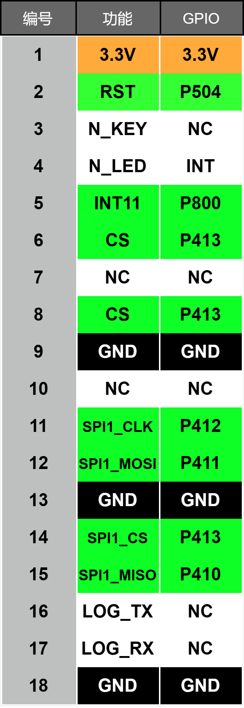
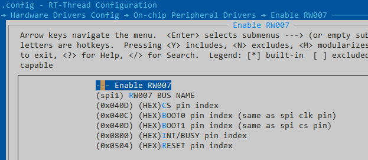
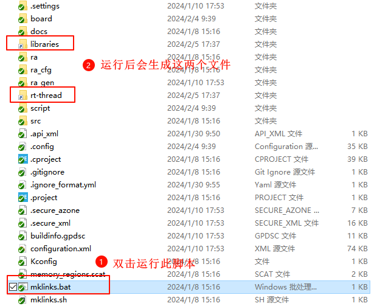
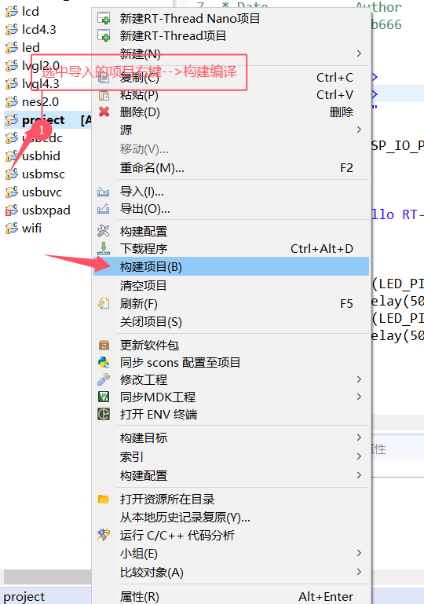
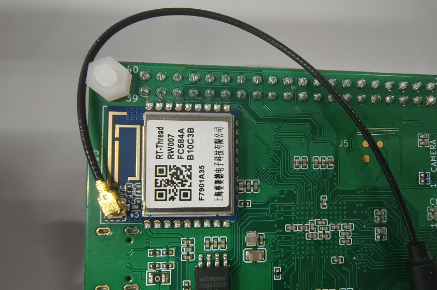
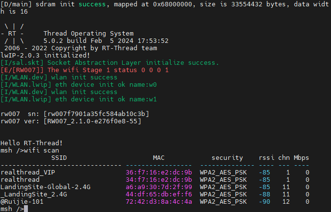
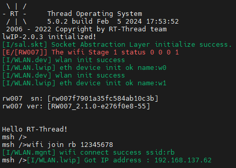
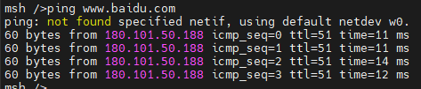
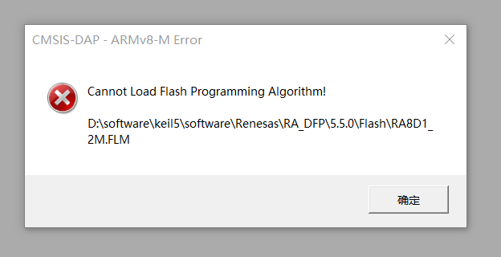
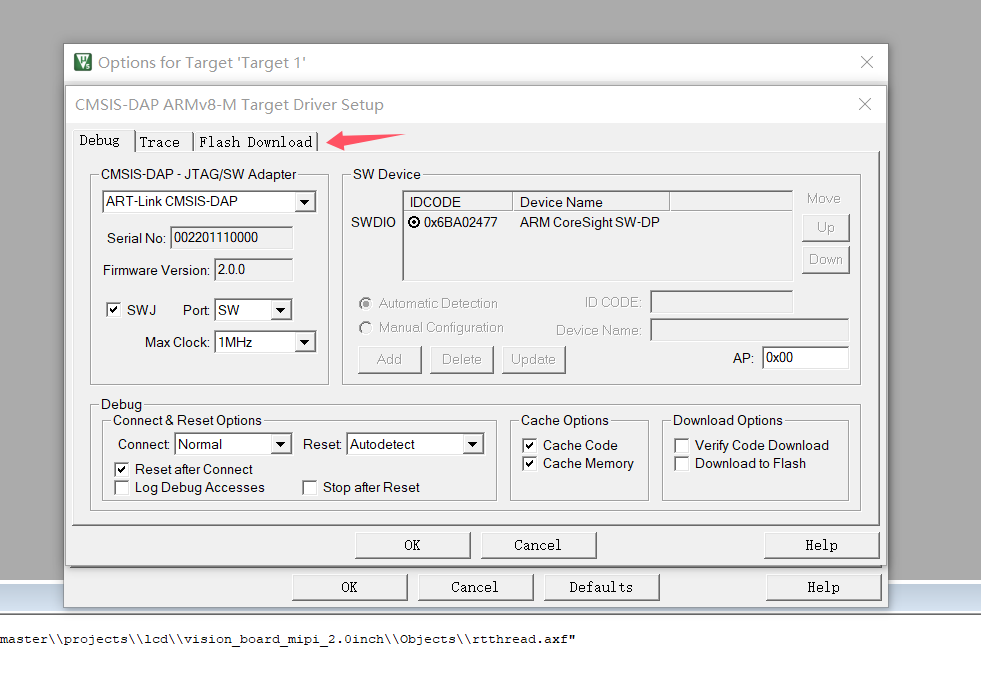

# Wi-Fi&RW007 示例工程

## 介绍

[RW007](https://www.rt-thread.org/document/site/#/rt-thread-version/rt-thread-standard/application-note/packages/rw007_module_using/an0034-rw007-module-using?id=rw007)是由上海睿赛德电子科技有限公司开发的高速 WiFi 模块，使用 SPI 与主机通信 ，支持 IEEE 802.11b/g/n 网络、 WEP/WPA/WPA2 加密方式和 STA 和 AP 模式。

## 主要特性

- 高性能 MCU
- 使用 SPI 通信方式
- SPI 时钟高达 30Mbps
- 支持 WiFi+BLE 主从机功能
- BLE 主机功能可同时连接多个 BLE 设备
- WiFi 支持 STA+AP 模式
- 支持微信小程序 BLE 快速配网
- 支持断网快速回连
- 内置 Bootloader，支持 OTA 固件升级、安全固件功能
- 支持批量远程升级，方便运维管理

## 准备工作

各 IO 接口与功能之间的对应关系表：



下图展示了 RW007 在 ENV 工具中的配置：



## 运行

### 编译&下载

#### MDK 方式

1、双击 `mklinks.bat` 文件，执行脚本后会生成 `rt-thread`、`libraries` 两个文件夹：



2、编译固件

双击 **project.uvprojx** 文件打开MDK工程


点击下图按钮进行项目全编译：


3、烧录固件

将开发板的 Dap-Link USB 口与 PC 机连接，然后将固件下载至开发板。


#### RT-Thread Studio方式

双击mklinks.bat，会产生两个文件夹libraries和rt-rthread


在当前项目路径下打开env，在env中输入scons --target=eclipse


打开RT-Thread Studio，左上角菜单栏，文件-->导入





## 运行效果

* **注意**：强烈建议在运行 Wi-Fi 示例前将 Wi-Fi 天线插入到模组上，以保证信号质量



1、测试 Wi-Fi 扫描功能：

打开串口终端，波特率为115200，输入以下命令进行 Wi-Fi 扫描：

```shell
WiFi scan
```



2、测试 Wi-Fi 连接功能：

输入以下命令进行 Wi-Fi 连接

```
wifi join 要连接的热点名称 要连接的热点密码
```

输入完成后，等待连接成功获取到 IP地址即可：



3、测试 Wi-Fi 联网功能：

输入以下命令测试 Wi-Fi 联网功能

```
ping www.baidu.com
```



## QA

Q：遇到在使用 Dap-Link 时找不到目标芯片的情况并且无法下载：


A1：方法一：**由于 JTAG/SWD 在芯片出厂时首次使用是加锁的**。请按住开发板的RST按键（正面右一）不松手。再次点击MDK下载按钮后，快速松开RST按键即可。后续无需重复以上操作。

A2：方法二：使用  [Renesas Flash Programmer](https://www.renesas.com/us/en/software-tool/renesas-flash-programmer-programming-gui#documents) 烧录工具进行第一次烧录，操作方法如下：


**Q:  遇到编译报错（MDK）：**


问题：找不到hal_entry函数

**A:**  解决方法：hal_entry函数定义在src文件夹下，在mdk中从新把这个文件添加进去后编译即可解决


**Q:  下载报错（MDK）：**




**A:**  解决方法：





